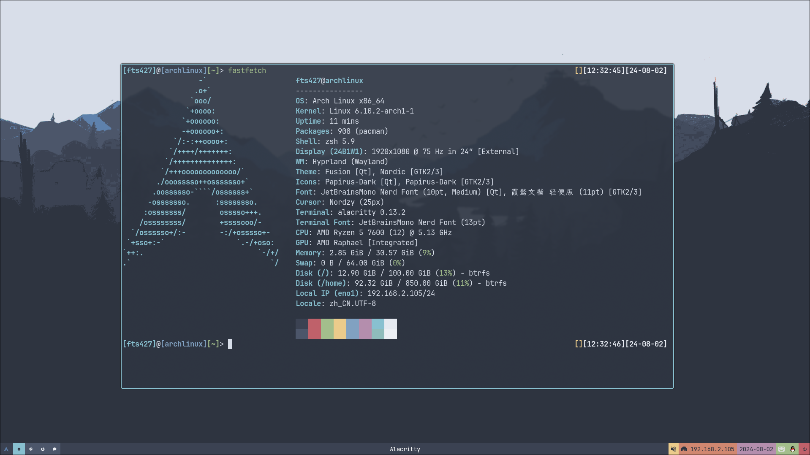

# 关于我

## 称呼

你可以叫我 `FTS427` 或 `Huang FTS427`

为什么这样叫？这些字符在某种情况下可以呈现出我的真名，当然，"Huang" 是我的姓，这一眼就可以看出来

## 喜好

没有喜欢吃的或喝的，喜欢过着很简单的慢节奏生活，我不太喜欢跑起来，这样会忽略生活中不起眼的美好

当然，也有喜欢的东西：

我爱开源社区，ta为每个人都提供便利；我喜欢研究 `TUI` 和 `CLI` 程序，这让我深入思考

我也爱着 `Arch Linux`，她确实给我带来了很多便利

我平时也打游戏，不过不会玩太长时间，很少玩多人游戏

Minecraft Bedrock, Minecraft Java, Undertale, Soul Knight, BlueArchive(国际服), 浮岛物语

~~还喜欢睡觉~~

## 在这里找到我

QQ: 2783629533

E-mail:

- <FTS427@outlook.com>

- <FTSquantum@gmail.com>

[我的B站空间](https://space.bilibili.com/1978537245?spm_id_from=333.1007.0.0)

## 开发环境

虽然配置都不是很好，但是还是想亮出来

### 计算机

主机: Dell Optiplex 780

主力系统: Arch Linux

备用开发系统: Windows 10 Work Station

桌面环境: i3wm

CPU: AMD Athlon II X2 270 @ 3.4GHz

运存: 8GB

Swap: 30GB

硬盘: 512GB WD

显示器: AOC 1920 x 1080

### 移动设备

机型: Lenovo TB-X306FC_PRC

OS: Lineage 19 (Android 12L, GSI)

附加: Magisk 27.0 + LSPosed 1.9.2

CPU: MT6765

运存: 3.8GB

内存: 64GB

Swap: 2GB

## 我的项目

[MathTool-CLI](https://github.com/QuantumLS-Studio/MathTool-CLI) written in C

[ECPPH](https://github.com/QuantumLS-Studio/ECPPH) written in C++

[llbds_packer](https://github.com/FTS427/llbds_packer) GitAction

[neofetch_for_minecraft_bedrock](https://github.com/FTS427/neofetch_for_minecraft_bedrock) written in JavaScript

[QuantumLS-Studio](https://github.com/QuantumLS-Studio) 我的工作室，欢迎加入！

## 梦想

我在朝着一个模糊的光亮奔跑...

## 职位

马上中考的初三学生 &

`ZH-Server` & `Zn Server` 的 ~~不称职~~ 腐竹（ &

`WonderLab.Override` 综合评价员（ &

~~夏莱老师~~ &

一个友善的朋友
