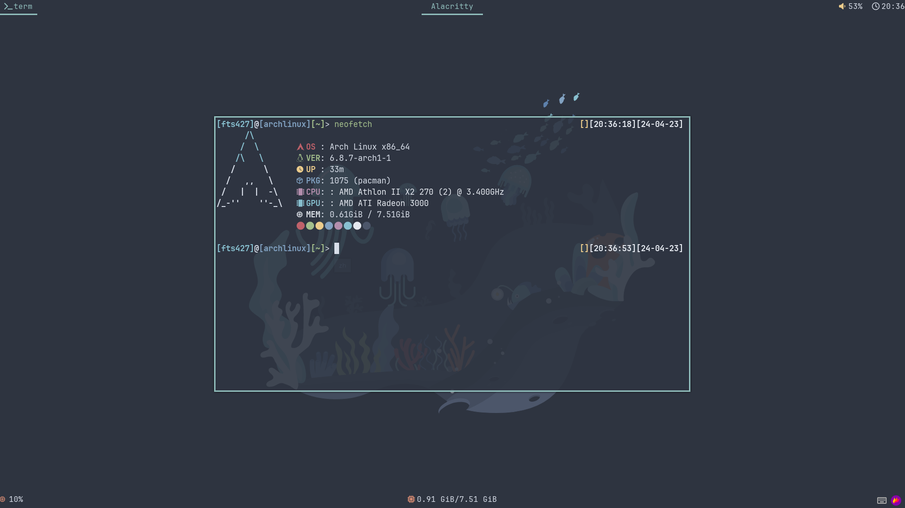

# 关于我

## 称呼

你可以叫我 `FTS427` 或 `Huang FTS427`

为什么这样叫？这些字符在某种情况下可以呈现出我的真名，当然，`Huang` 是我的姓，这一眼就可以看出来

## 特性

> 我先声明：我不属于 `彩旗群体`(`LGBTQ+群体`)，但是我尊重 ta 们，我希望你也可以尊重这个群体

你可以把我当作男生，也可以当做女生，或者无性别，我不在乎这些，如果你想用第三人称指代我，可以用 `he`(`他`) 来指代我

是个宅，平时不太喜欢出门，但是我其实也很喜欢大自然

1.76 米左右，不算很高，刚刚好

家境比较贫寒，不过还好，我的金钱欲几乎没有

有时候会显得比较个人主义，但是我正在尽力改正

## 喜好

没有喜欢吃的或喝的，喜欢过着很简单的慢节奏生活，我不太喜欢跑起来，这样会忽略生活中不起眼的美好

当然，也有喜欢的东西：

我爱开源社区，开源社区为每个人都提供便利；我喜欢研究 `TUI` 和 `CLI` 程序，这让我深入思考

我也爱着 `Arch Linux` ，她确实给我带来了很多便利

我平时也打游戏，不过不会玩太长时间，很少玩多人游戏

Minecraft Bedrock, Minecraft Java, Undertale, Soul Knight, BlueArchive(国际服), 浮岛物语

> 我是 Minecraft 正版玩家

~~还喜欢睡觉~~

## 在这里找到我

QQ: 2783629533

E-mail:

- <FTS427@outlook.com>

- <FTSquantum@gmail.com>

Xbox ID: Huang_FTS427

[我的B站空间](https://space.bilibili.com/1978537245?spm_id_from=333.1007.0.0)

## 开发环境

虽然配置都不是很好，但是还是想亮出来

### 计算机

主力系统: Arch Linux

备用开发系统: Windows 10 Work Station

桌面环境: Hyprland

CPU: AMD Ryzen 5 7600 (12) @ 5.13 GHz

运存: 32GB

Swap: 64GB

硬盘: 2TB Lexar

显示器: AOC 1920 x 1080

### 移动设备

机型: Lenovo TB-X306FC_PRC

OS: Lineage OS 17.1 Unofficial (Android 10)

CPU: MT6765/MT8768

运存: 4GB

存储空间: 64GB

Swap: 2GB

## 我的项目

[MathTool-CLI](https://github.com/QuantumLS-Studio/MathTool-CLI) written in C

[ECPPH](https://github.com/QuantumLS-Studio/ECPPH) written in C++

[llbds_packer](https://github.com/FTS427/llbds_packer) GitAction

[QuantumLS-Studio](https://github.com/QuantumLS-Studio) 我的工作室，欢迎加入！

## 梦想

我在朝着一个模糊的光亮奔跑...

## 职位

`ZH-Server` 的 ~~不称职~~ 腐竹（ &

`WonderLab.Override` 综合评价员（ &

`Blessing Studio` 中的一个无名小卒，经常干一些杂活 &

~~夏莱老师~~ &

一个友善的朋友
