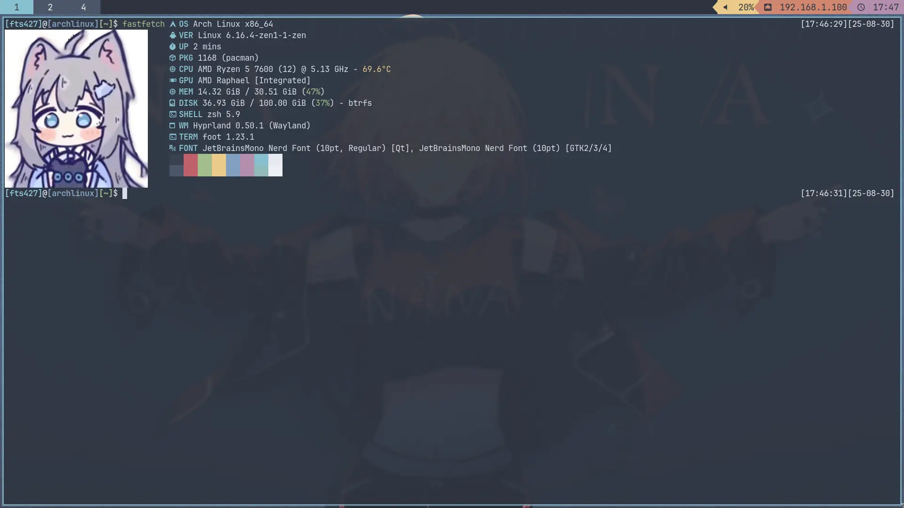

# 工作环境配好啦~

先放一张效果图

主要是对 GTK 和 Qt 程序进行了统一, 当然, Waybar 也进行了改动(虽然还是基于[这个](https://github.com/lokesh-krishna/dotfiles)的改的)

Hyprland 的键位也有所调整，和 i3wm 当时设置的键位差不多，除了 终端 是 Win+T (因为 Hyprland 下的 Win+Enter 似乎无法正常使用)

当然，也有不少小问题，比如个别应用不支持 Wayland 环境导致启动报错，Fcitx5 时不时抽风没法打字，以及 Minecraft 里没法输入中文，QQ 没法分享屏幕

不过总体上来说还好

## MAL

MAL -- MinecraftArchive Launcher 是一个基于 WonderLab 的带有 Blue Archive UI 的启动器 ~~（玩 BA 玩的）~~ ，制作的原目的是因为 WonderLab 的重构版没法进行启动 Minecraft ，所以我直接 Fork 了旧版进行个人维护

## 群聊分离

因为一些原因，最近把 ZH-Server 的群聊进行了拆分,分为了主群和聊天群,主群保留原样(移除Bot),聊天群新建的,群号是: 980774372 欢迎来玩
