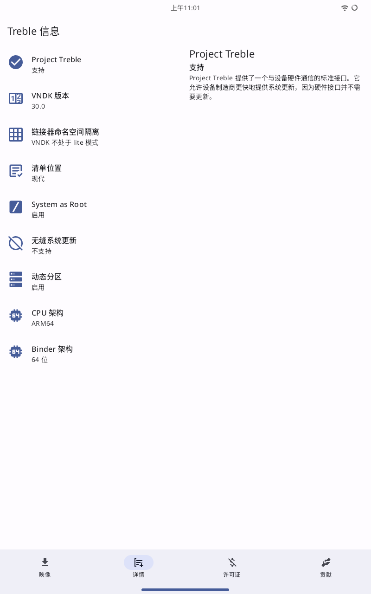

# 刷系统————逃离原厂各种垃圾功能

## 引入

对于 `Lenovo` 的平板来说，直接支持的rom很少，或者说根本就没有，因为 `Lenovo` 平板也算是 `冷门` 机型了

> 我正在考虑在2024年的暑假期间自己编译一个基于`Lineage OS`的rom为我的这部`冷门`机器，如果您对此也有兴趣可以联系我

所以通过设备对 `GSI` 的支持进行换系统、刷机

## GSI 初步认识

### 什么是 `GSI`？

`GSI` 是 `Gobal System Image` 也就是 `通用系统镜像`，是一种神奇的Android通用镜像，ta可以忽略“是否兼容硬件”这种疑问进行更换系统，这无疑是很好的；当然，使用ta也将可能会面临着硬件调用不合理导致的一些问题，如：续航变短、手势跟不上、屏幕亮度奇怪等。但是，总比住原厂的“垃圾堆”里强吧

[关于 `GSI` 的Google官方文档](https://source.android.google.cn/docs/setup/create/gsi?hl=zh-cn)

### 设备检查

检查您的设备是否支持GSI，可以使用[Treble Info](https://gitlab.com/api/v4/projects/30453147/packages/generic/apk/5.2.3/TrebleInfo-free.apk)完成检查

如果检查结果如上图，恭喜您！您的设备支持GSI，让我们进入下一步吧！

如果检查结果显示您的设备不支持GSI，那么您就可以就此暂停了

## 寻找合适的 `GSI` 镜像

目前，我已经体验过三款 `GSI` 系统，分别为：

Dot OS 5, Lineage OS 18 & 19, PixelExpenrience Android 13

当然，你也可以在[这份清单](https://github.com/phhusson/treble_experimentations/wiki/Generic-System-Image-%28GSI%29-list)上寻找你喜欢的GSI镜像

我之前在 `Dot OS` 上过的“逍遥快活”，我个人认为 `Dot OS` 是这几款里面既有颜值又有可玩性的一个。但是使用ta也将面临有些缺陷，如：

- 对平板设备的支持虽然有，但很差
- 续航变短（估计是GApps的问题）
- 有时候会莫名其妙的卡顿

## 刷入

由于没有一个标准的、官方的`TWRP`对其支持，所以只能通过最原始的手段进行刷入，也就是通过`fastbootd`（不是`fastboot`，Android从11就开始弃用`fastboot`转而使用`fastbootd`）来刷写系统

> 其实我本人构建过为这台机器的`TWRP`，但是问题很多以至于我放弃了

### `FastbootD` & `Fastboot`
